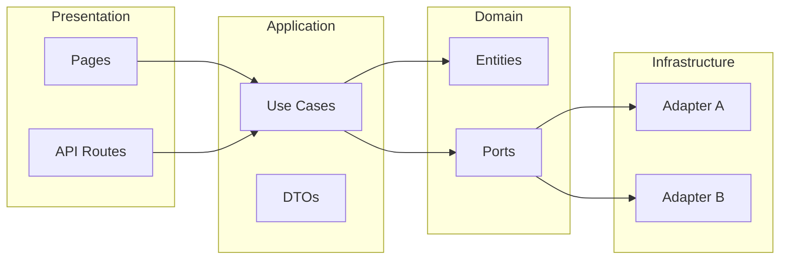

# Arquitectura — Cuerporaiz

## Principio: proveedores intercambiables

Cualquier servicio externo (email, pagos, CMS, auth) debe poder sustituirse sin reescribir lógica de negocio. La regla:

1. **Un port (interfaz)** que define qué necesita la aplicación (ej. “enviar email”, “crear checkout”).
2. **DTOs** para entrada y salida: la aplicación trabaja solo con DTOs, nunca con tipos propios del proveedor (Resend, Flow, Sanity, etc.).
3. **Un adapter** por proveedor que implementa el port: traduce DTOs ↔ API del proveedor.
4. **Configuración** (env o config) para elegir qué adapter usar.

Para cambiar de proveedor (ej. Resend por otro servicio de email): se implementa un nuevo adapter que cumpla el mismo port, se mapean los DTOs existentes al nuevo API y se cambia la configuración. No se tocan use cases ni dominio.

---

## Capas (hexagonal)



- **Domain:** Entidades puras, value objects, errores de dominio. Sin dependencias de framework ni de proveedores.
- **Application:** Casos de uso que orquestan dominio y puertos. Entrada/salida solo vía **DTOs**.
- **Ports (interfaces):** Definidos en application (o domain). Ej: `EmailProvider.send(dto: SendEmailDto): Promise<SendEmailResultDto>`.
- **Infrastructure:** Adapters que implementan los ports (Resend, Mercado Pago, Sanity, NextAuth, Vimeo, etc.). Cada uno traduce entre DTOs y la API concreta.
- **Presentation:** App Router, API routes. Solo llaman a use cases y devuelven DTOs o HTML. No conocen proveedores concretos.

---

## Fuente de verdad: backend vs Sanity

- **Backend propio** es la fuente de verdad de:
  - Usuarios y autenticación
  - Compras, suscripciones (membresía), pagos
  - Reservas de clases presenciales
  - Permisos de acceso a contenido (packs, membresía, videos)
  - Historial de clases, pagos y accesos

- **Sanity** es solo contenido y catálogo:
  - Qué existe: tipos de clase, programas, retiros, textos de landing
  - Descripción de la oferta (packs, membresía, sesiones)
  - No almacena estado de pago, reservas ni permisos; el backend consulta Sanity para mostrar la oferta y luego persiste todo lo transaccional en su propia capa (DB o servicios).

### Dónde se guarda cada cosa

| Dónde | Qué |
|-------|-----|
| **Postgres (Supabase)** | Usuarios, centros, roles (RBAC), sesiones y todo lo transaccional: reservas, pagos, suscripciones, permisos de acceso. Es la base de datos de la aplicación. |
| **Sanity (CMS)** | Contenido editorial y catálogo: textos, programas, tipos de clase, descripciones de oferta. Solo lectura desde el backend; no guarda estado de usuario ni transacciones. |

Conectar Postgres: `DATABASE_URL` en `.env` (ver `.env.example`). Migraciones: `prisma migrate dev` / `prisma migrate deploy`.

---

## DTOs

- **Request DTOs:** Validados en el borde (API o Server Action) con zod (o similar). Ej: `CreateCheckoutDto`, `SendEmailDto`.
- **Response DTOs:** Lo que devuelven los use cases. Ej: `CheckoutResultDto`, `PackDto`, `MembershipDto`.
- Los adapters reciben y devuelven estos mismos DTOs; internamente mapean a/desde el formato del proveedor. El dominio y la aplicación nunca ven tipos de Resend, Flow, Sanity, etc.

---

## Ejemplo: cambiar de Resend a otro proveedor de email

1. **Port (ya existe):**  
   `EmailProvider.send(params: SendEmailDto): Promise<SendEmailResultDto>`

2. **Nuevo proveedor:** Implementar un adapter (ej. `SendgridEmailAdapter`) que implemente `EmailProvider`: dentro del método, traducir `SendEmailDto` al formato de la API del nuevo proveedor y convertir la respuesta a `SendEmailResultDto`.

3. **Config:** En el contenedor o factory que resuelve dependencias, usar `SendgridEmailAdapter` en lugar de `ResendEmailAdapter` (p. ej. variable de entorno `EMAIL_PROVIDER=sendgrid`).

4. **Use cases y DTOs:** Sin cambios. Siguen usando `SendEmailDto` y `SendEmailResultDto`.

Mismo patrón para pagos (Mercado Pago u otro), CMS (Sanity vs otro), video (Vimeo vs otro) o auth: port + DTOs + adapter + config.

---

## Estructura de carpetas sugerida

```
lib/
  domain/           # Entidades, value objects
  application/      # Use cases, DTOs, ports (interfaces)
  infrastructure/   # Adapters: sanity, mercadopago, resend, auth, vimeo, etc.
```

O, si se prefiere todo en raíz sin `src/`:

```
app/                # Next App Router (presentation)
lib/
  domain/
  application/
  infrastructure/
components/
```

Cada adapter en su propio módulo (ej. `infrastructure/email/resend.adapter.ts`, `infrastructure/email/sendgrid.adapter.ts`). El punto de entrada (factory o index) decide qué adapter inyectar según configuración.

---

## Seguridad

- Validación en cliente y en servidor; en el borde se validan los DTOs de entrada (zod).
- Secrets solo en servidor; `NEXT_PUBLIC_*` solo para lo estrictamente público.
- Webhooks: verificación de firma e idempotencia.
- Rate limiting en endpoints críticos (login, checkout, newsletter).

---

## Convenciones

- Naming: PascalCase componentes, camelCase funciones, SCREAMING_SNAKE constantes.
- Server Components por defecto; Client Components solo cuando haga falta interactividad.
- Imports: React/Next → externals → internos → relativos → types.

---

**Resumen:** Un port, DTOs claros, adapters por proveedor. Cambiar de Resend (o de Flow, Sanity, etc.) = implementar nuevo adapter + config; la aplicación sigue igual.
